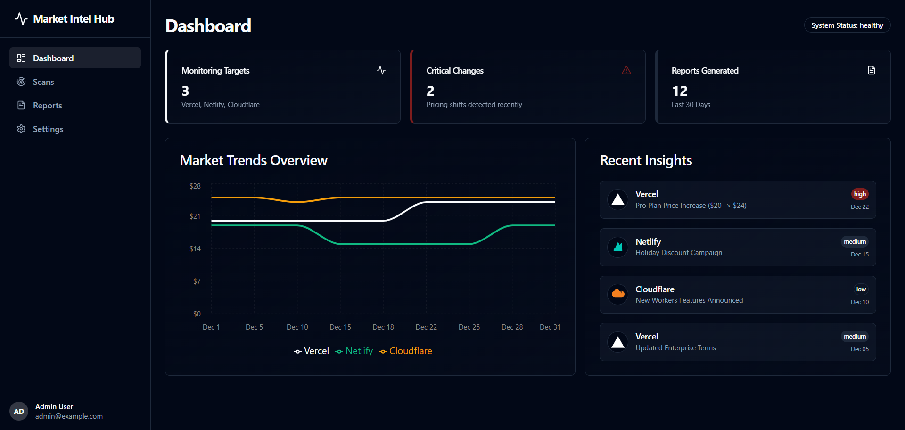
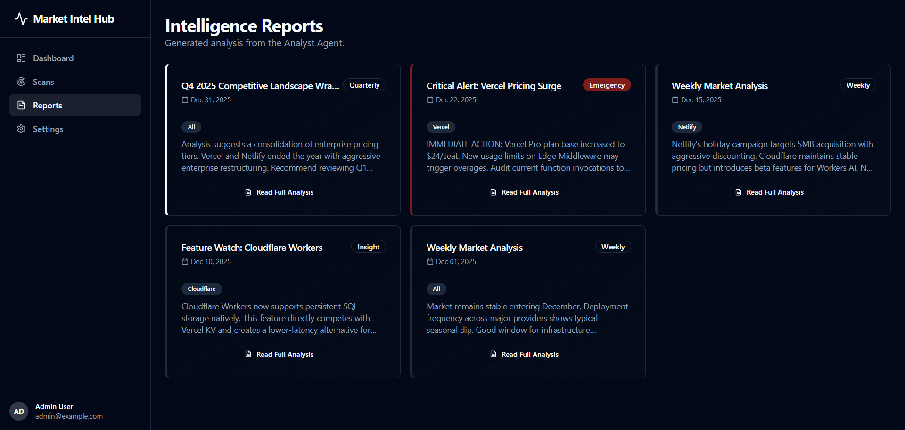
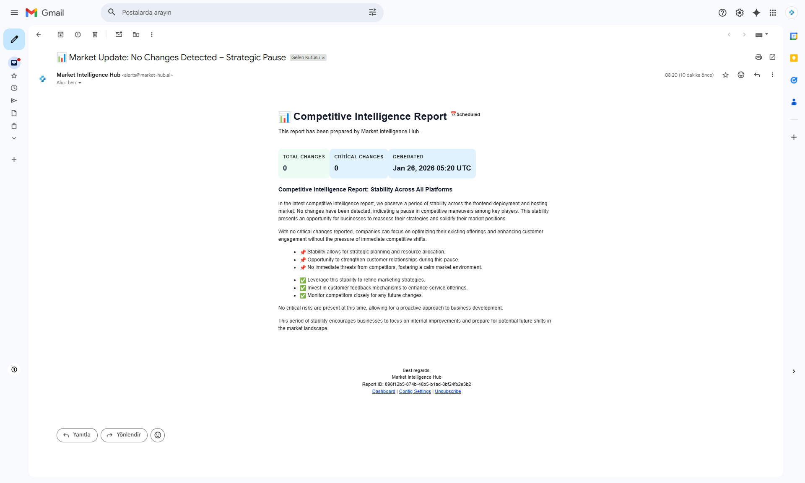

#  Agentic Market Intelligence Hub

> **Transforming competitive intelligence from reactive monitoring to proactive strategic advantage through autonomous AI agents.**

## 1. The Problem: The High Cost of Latency in Competitive Strategy

In fast-moving platform-as-a-service markets where pricing changes weekly, a 24-hour detection delay means missing the response window entirely. A competitor's tier restructuring on Monday requires your pricing adjustment by Tuesday—not Friday.

Whether a large organization protecting margins or a local player fighting for market share, the impact of missing a competitor's move is critical. In these environments, intelligence gaps create specific vulnerabilities:

*   **The Cost of Delay**: In high-tempo competition, a pricing or packaging change is a strategic signal. Detecting it days late means missing the narrow window to counter-maneuver, leading to revenue loss or eroded positioning.
*   **Decision Fragility**: Without timely context, decisions become reactive. By the time a change is noticed manually, the opportunity to respond (e.g., a counter-campaign or price adjustment) has often already passed.
*   **Asymmetric Impact**: This is not just an enterprise problem. For a smaller firm competing on price positioning, a week-late response to a competitor's 10% price cut can **permanently shift customer perception**.

### Why Existing Tools Fail
*   **Generic Scrapers (e.g., Diffbot)**: Detect changes but lack domain context (cannot distinguish a 'bug fix' from a 'strategic pivot').
*   **Manual Analyst Teams**: Provide context but scale poorly and react slowly.

Neither delivers timely + contextual intelligence at scale.

**The core problem is not data access—it is the lack of timely, contextual, and decision-ready intelligence needed to act before the market moves on.**

---

## 2. The Solution: Agentic Market Intelligence

Agentic Market Intelligence Hub addresses this gap by rethinking competitive intelligence as a continuous decision-support system, not a monitoring script.

The system uses a **modular agent pattern** where each component has a single responsibility. This separation enables independent evolution which prevents upgrading analysis logic from breaking the data collection layer.

1.  **Watcher**: Structured data collection (Base tier pricing, Feature limits, Plan availability).
2.  **Analyst**: Deterministic change detection (Comparing snapshots for variance, e.g., >5%).
3.  **Reporter**: Business-ready synthesis (Alerts triggered <30 mins after detection).

This agentic approach enables depth, clarity, and speed that traditional pipelines cannot provide.

**The goal is not just to detect change — but to surface strategic meaning before competitors can react.**

This is not automation of monitoring — it is automation of **strategic sense-making**.

---

## 3. Business Value & Impact

The value of Agentic Market Intelligence Hub is measured in speed, accuracy, and strategic confidence.

### Operational Efficiency
*   **Manual monitoring**: ~20 hours/week → Automated: ~2 hours/week (**90% reduction**)
*   **Systematic detection** minimizes human oversight and fatigue

### Strategic Advantage
*   **Detection latency**: 3-5 days (manual) → <6 hours (automated)
*   **Response window**: From "Friday report" to "Same-day alert"

### Risk & Cost Reduction
*   Reduced missed opportunities caused by delayed awareness
*   Lower cost of competitive analysis through automation
*   Strong audit trail of historical changes for retrospectives

### MVP Scope: Focused Validation of Real Business Value

This repository represents a deliberately constrained MVP, designed to validate the problem-solution fit and business value with high signal clarity.

| Dimension | MVP Implementation |
| :--- | :--- |
| **Monitored Scope** | Live pricing pages of Vercel, Netlify, Cloudflare |
| **Detected Signals** | Pricing & tier changes |
| **Decision Logic** | Deterministic, rules-based evaluation |

### Monitoring Focus: The "Cloud Hosting" Domain
We deliberately chose the Vercel/Netlify/Cloudflare market because raw price tracking is insufficient here. This domain requires detecting complex changes—like edge compute limits and tiers—where pricing is often a response to competitors, creating a perfect testbed for observing correlated market moves.

This focus ensures that the system solves a real, painful, and high-impact problem first—before expanding breadth.

> **Competitive advantage is no longer about who has more data — it’s about who understands change first.**

**Delivering this level of speed and clarity consistently requires more than automation — it requires a system designed for decision-making.**

---

## 4. Data Collection Standards

Our monitoring adheres to industry best practices, positioning us as responsible practitioners in competitive intelligence:

*   ✓ **Public pricing pages only** (no login/PII accessed)
*   ✓ **Respects robots.txt** and rate limits
*   ✓ **Full audit trail** with timestamps for transparency
*   ✓ **Output**: Business metrics only (no raw HTML storage)

This commitment to responsible engineering ensures that the system provides strategic value without compromising ethical standards or integrity.

---

## 5. Industry Applicability: Beyond Tech

While the MVP validates the architecture within the Cloud Hosting sector, the system is designed as a **domain-agnostic intelligence engine**. When configured to operate within specific sectoral legal frameworks and official data access protocols (e.g., authorized APIs), its ability to detect structural changes is applicable across diverse high-value markets:

*   **Retail & E-Commerce**: Monitoring dynamic pricing and stock velocity.
*   **Real Estate & Automotive**: Detecting listing price adjustments and inventory trends in fast-moving local markets.
*   **Financial Services**: Tracking product interest rates, loan terms, and public compliance disclosures.
*   **SME Competitiveness**: Enabling small businesses to automate competitor benchmarking without enterprise budgets.

**The core capability—transforming raw observation into strategic signal—is universal.**

---

## 6. Architecture Logic

The system relies on a sequential agentic workflow because **agentic design allows independent evolution of observation, interpretation, and communication**. This modular design ensures that each component can be independently upgraded.

### Agent Roles

#### The Watcher Agent (Field Observer)
*   **Role**: Acts as the system's boundary interface, isolating the complexity of the live web from the analysis logic.
*   **MVP Behavior**: Executes **live, structured monitoring** of pricing pages for Vercel, Netlify, and Cloudflare.
*   **Architecture Capability**: Designed to provide a deterministic data ingestion layer, ensuring that downstream analysis is fed with consistent, structured snapshots.
*   **Why It Matters**: Reliable intelligence starts with trustworthy data. The Watcher ensures that strategic decisions are not based on outdated or incomplete information.

#### The Analyst Agent (Strategic Interpreter)
*   **Role**: The deterministic decision engine that evaluates new market data.
*   **MVP Behavior**: Applies **precise deterministic comparison logic** to identify specifically defined shifts in pricing and tier limits.
*   **Architecture Capability**: operates within a strictly defined scope (Price & Tiers) for this showcase, validating the "comparison engine" pattern used in larger internal versions.
*   **Why It Matters**: This is where raw data turns into strategic signal. The Analyst ensures that only meaningful changes reach decision-makers.

> *Visual Evidence: Deep dive analysis report generated by the Analyst Agent.*

#### The Reporter Agent (Communicator)
*   **Role**: Translates technical change signals into business-ready intelligence.
*   **MVP Behavior**: Synthesizes detection results into **production-aligned** output formats (Markdown/Email) that mimic executive briefs.
*   **Architecture Capability**: Demonstrates the separation of "Data Analysis" from "Insight Presentation," allowing for varied output formats.
*   **Why It Matters**: Insights only create value when they are understood and acted upon. The Reporter bridges technical detection and executive decision-making.

> *Real-world Impact: Instant email alerts triggered by significant market shifts.*

---

## 7. Looking Ahead: From Reactive to Proactive Intelligence

**The long-term vision is clear:**

> **Competitive intelligence should not report the past. It should shape the next move.**

While the current MVP focuses on high-precision detection (*utilizing deterministic evaluation*), future iterations aim to bridge the gap between observation and anticipation. Potential evolution paths include:

*   ***Trend recognition*** across historical pricing movements
*   ***Predictive modeling*** of competitor strategies
*   ***Scenario-based*** strategic recommendations
*   ***Deeper integrations*** into decision workflows

---
