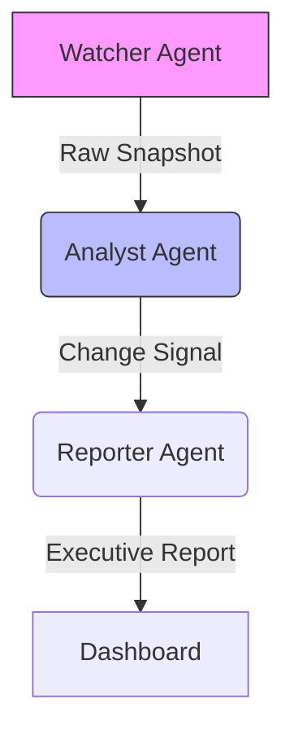

  

# Agentic Market Intelligence Hub

> **Transforming competitive intelligence from reactive monitoring to proactive strategic advantage through autonomous AI agents.**

## 1. The Problem: The Missing Link in Competitive Decision-Making

In highly competitive software markets, teams make strategic decisions under constant uncertainty. Competitor pricing changes, tier adjustments, and packaging decisions are among the strongest strategic signals—yet they are often detected late or managed through fragile manual processes.

Today’s reality for most teams looks like this:

*   **Delayed Awareness**: Pricing changes are often noticed days or weeks after they happen.
*   **Manual Overhead**: Product and strategy teams spend 15–20 hours per week manually checking competitor pages.
*   **Signal Loss**: Subtle but critical changes (limits, tier restructuring) are easily missed.
*   **Reactive Decisions**: By the time insights are compiled, the opportunity to respond strategically is already gone.

Traditional scraping tools generate raw data without context. Analytics platforms show historical trends but fail to explain what changed, why it matters, and what to do next.

**The core problem is not data access — it is timely, contextual, and decision-ready intelligence.**

---

## 2. The Solution: Agentic Market Intelligence

Agentic Market Intelligence Hub addresses this gap by rethinking competitive intelligence as a continuous decision-support system, not a monitoring script.

Instead of a single monolithic process, the system is designed as a coordinated digital intelligence team, where each component has a clear responsibility:

1.  **Observe** relevant market signals in real time
2.  **Interpret** what changed and assess strategic impact
3.  **Communicate** insights in a format decision-makers can act on

This agentic approach enables depth, clarity, and speed that traditional pipelines cannot provide.

**The goal is not just to detect change — but to surface strategic meaning before competitors can react.**

---

## 3. Business Value & Impact

The value of Agentic Market Intelligence Hub is measured in speed, accuracy, and strategic confidence.

### Operational Efficiency
*   Manual competitive monitoring reduced from 15–20 hours/week to near zero
*   Systematic detection minimizes human oversight and fatigue
*   Repeatable, reliable intelligence generation

### Strategic Advantage
*   Near real-time alerts on pricing and tier changes
*   Faster reaction to competitor moves
*   **Immediate visibility** into pricing and tier updates before manual reports are compiled

### Risk & Cost Reduction
*   Reduced missed opportunities caused by delayed awareness
*   Lower cost of competitive analysis through automation
*   Strong audit trail of historical changes for retrospectives

### MVP Scope: Focused Validation of Real Business Value

This repository represents a deliberately constrained MVP, designed to validate the problem-solution fit and business value with high signal clarity.

| Dimension | MVP Implementation |
| :--- | :--- |
| **Monitored Scope** | Live pricing pages of Vercel, Netlify, Cloudflare |
| **Detected Signals** | Pricing & tier changes |
| **Decision Logic** | Deterministic, rules-based evaluation |

### Monitoring Focus: The "Cloud Hosting" Domain
I deliberately chose the Vercel/Netlify/Cloudflare market because raw price tracking is insufficient here. This domain requires detecting complex changes—like edge compute limits and tiers—where pricing is often a response to competitors, creating a perfect testbed for observing correlated market moves.

This focus ensures that the system solves a real, painful, and high-impact problem first—before expanding breadth.

> **Competitive advantage is no longer about who has more data — it’s about who understands change first.**

**Delivering this level of speed and clarity consistently requires more than automation — it requires a system designed for decision-making.**

---

## 4. Architecture Logic

The system relies on a sequential agentic workflow because **agentic design allows independent evolution of observation, interpretation, and communication**. This modular design ensures that each component can be independently upgraded.

### Agent Roles

#### The Watcher Agent (Field Observer)
*   **Role**: Acts as the system's boundary interface, isolating the complexity of the live web from the analysis logic.
*   **MVP Behavior**: Executes **live, structured monitoring** of pricing pages for Vercel, Netlify, and Cloudflare.
*   **Architecture Capability**: Designed to provide a deterministic data ingestion layer, ensuring that downstream analysis is fed with consistent, structured snapshots.
*   **Why It Matters**: Reliable intelligence starts with trustworthy data. The Watcher ensures that strategic decisions are not based on outdated or incomplete information.

#### The Analyst Agent (Strategic Interpreter)
*   **Role**: The deterministic decision engine that evaluates new market data.
*   **MVP Behavior**: Applies **production-grade change detection logic** to identify specifically defined shifts in pricing and tier limits.
*   **Architecture Capability**: operates within a strictly defined scope (Price & Tiers) for this showcase, validating the "comparison engine" pattern used in larger internal versions.
*   **Why It Matters**: This is where raw data turns into strategic signal. The Analyst ensures that only meaningful changes reach decision-makers.

> *Visual Evidence: Deep dive analysis report generated by the Analyst Agent.*

#### The Reporter Agent (Communicator)
*   **Role**: Translates technical change signals into business-ready intelligence.
*   **MVP Behavior**: Synthesizes detection results into **production-aligned** output formats (Markdown/Email) that mimic executive briefs.
*   **Architecture Capability**: Demonstrates the separation of "Data Analysis" from "Insight Presentation," allowing for varied output formats.
*   **Why It Matters**: Insights only create value when they are understood and acted upon. The Reporter bridges technical detection and executive decision-making.

> *Real-world Impact: Instant email alerts triggered by significant market shifts.*

---

## 5. Ethics & Responsible Data Collection

The Agentic Market Intelligence Hub operates under strict ethical guidelines, ensuring that automated intelligence gathering is respectful, transparent, and legally compliant.

*   **Public Data Only**: The system exclusively monitors **publicly available pricing and product pages**. It does not access, collect, or attempt to infer any private user data, behind-login content, or personally identifiable information (PII).
*   **Respectful Automation**: We employ **responsible automated monitoring** rather than aggressive data extraction. The architecture strictly adheres to standard rate limits (respecting `robots.txt` policies in production) to ensure zero impact on target service availability.
*   **Auditability & Transparency**: Every automated interaction is logged with precise timestamps and origin headers. This creates a transparent audit trail, ensuring that all collected data can be traced back to its public source.
*   **Ethical Insight Generation**: The analysis layer is designed to output only high-level business metrics (e.g., "Price increased by 15%"), filtering out any potential inadvertently collected noise.

This commitment to responsible engineering ensures that the system provides strategic value without compromising ethical standards or integrity.

---

## 6. Industry Applicability: Beyond Tech

While the MVP validates the architecture within the Cloud Hosting sector, the system is designed as a **domain-agnostic intelligence engine**. When configured to operate within specific sectoral legal frameworks and official data access protocols (e.g., authorized APIs), its ability to detect structural changes is applicable across diverse high-value markets:

*   **Retail & E-Commerce**: Monitoring dynamic pricing and stock velocity.
*   **Real Estate & Automotive**: Detecting listing price adjustments and inventory trends in fast-moving local markets.
*   **Financial Services**: Tracking product interest rates, loan terms, and public compliance disclosures.
*   **SME Competitiveness**: Enabling small businesses to automate competitor benchmarking without enterprise budgets.

**The core capability—transforming raw observation into strategic signal—is universal.**

---

## 7. Looking Ahead: From Reactive to Proactive Intelligence

**The long-term vision is clear:**

> **Competitive intelligence should not report the past. It should shape the next move.**

While the current MVP focuses on high-precision detection (*utilizing deterministic evaluation*), future iterations aim to bridge the gap between observation and anticipation. Potential evolution paths include:

*   ***Trend recognition*** across historical pricing movements
*   ***Predictive modeling*** of competitor strategies
*   ***Scenario-based*** strategic recommendations
*   ***Deeper integrations*** into decision workflows

---