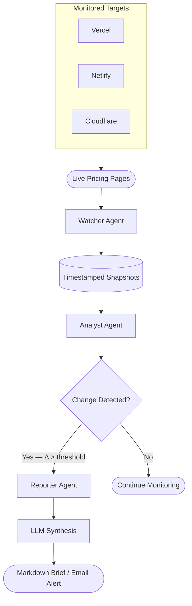

<div align="center">

# 🕵️ Market Intelligence Hub
**Autonomous competitive awareness — from signal to strategy.**


| [English](#) |

---

**[Overview](#-overview) • [Architecture](#-architecture) • [Key Features](#-key-features) • [Tech Stack](#-tech-stack) • [Getting Started](#-getting-started)**

</div>

---

**Market Intelligence Hub** is a production-grade, modular **Agentic Intelligence** system designed for continuous competitive monitoring of cloud hosting markets. As a **Production-Grade MVP**, the system is specifically optimized for tracking **Vercel, Netlify, and Cloudflare** pricing pages, showcasing the power of agentic workflows in transforming raw web observations into actionable strategic signals.

Unlike traditional monitoring scripts, it uses a **"Three Minds, One Mission"** philosophy — where three specialized agents independently handle observation, analysis, and communication, each upgradeable without touching the others.

---

## 🚀 Key Features

- **👁️ Autonomous Observation:** The Watcher Agent continuously monitors live pricing pages with circuit-breaker patterns and exponential backoff — reliable ingestion without overloading targets.
- **🧠 Deterministic Signal Detection:** The Analyst Agent applies precise threshold-based comparison logic. No hallucinations, no guesses — only verified, meaningful deltas are flagged.
- **📡 LLM-Powered Synthesis:** Detected changes aren't just logged — the Reporter Agent uses language model reasoning to contextualize *what changed, why it matters, and what it signals strategically.*
- **⚡ Minute-Level Latency:** From a competitor's pricing update to a business-ready brief in your inbox — in minutes, not days.
- **🔇 Silent Guardian Model:** Operates quietly in the background. Scheduled digests for routine updates. Immediate alerts only for high-signal events.
- **🛡️ Responsible Collection:** Public pages only, `robots.txt` respected, full audit trail, no raw HTML stored — ethical competitive intelligence by design.

---

## 🏗 Architecture

The system follows a **modular agent pattern** with strict separation of concerns — each agent owns one responsibility and exposes a stable interface.



### 🤖 The Complete Agentic Pipeline

The system abandons monolithic monitoring scripts in favor of a deterministic, fault-tolerant pipeline built for high-tempo competitive markets. Each stage maps directly to a core agent:

1. **Structured Ingestion (`agents/watcher.py`):** The Watcher Agent fetches live pricing pages for all configured targets. It handles retries, respects rate limits, applies circuit-breaker logic, and emits clean structured snapshots — base pricing, tier limits, plan availability — with full timestamps.

2. **Change Detection (`agents/analyst.py`):** The Analyst Agent compares the latest snapshot against the previous baseline. It applies deterministic thresholds (e.g., `price_change > 5%`, `tier_feature_added`) to flag only meaningful variance. Noise is filtered; strategic signals pass through.

3. **Strategic Synthesis (`agents/reporter.py`):** When a signal is flagged, the Reporter Agent activates. It feeds the detected change into an LLM prompt engineered for competitive context — producing a business-ready brief that explains the change, its likely strategic implication, and suggested response window. Output is delivered as Markdown and/or Email.

---

## 🛠 Tech Stack

<div align="center">
  
  &nbsp;&nbsp;
  
  &nbsp;&nbsp;
  
</div>

<br/>

- **Orchestration:** Custom agentic loop (no heavyweight framework dependency)
- **Web Ingestion:** Playwright / httpx with exponential backoff
- **Change Detection:** Deterministic rule engine
- **LLM Synthesis:** GPT-4o (via OpenAI API)
- **Storage:** SQLite snapshot store + audit log
- **Delivery:** SMTP email + Markdown report generation

---

## 📂 Project Structure

```text
src/
├── agents/         # Watcher, Analyst, Reporter — core agent logic
├── core/           # Snapshot model, diff engine, change classifier
├── delivery/       # Email renderer, Markdown formatter
├── storage/        # SQLite adapter, audit trail writer
└── config/         # Target definitions, threshold config
```

---

## 🏁 Getting Started

### 1. Installation

```bash
# Clone the repository
git clone https://github.com/your-org/market-intelligence-hub.git
cd market-intelligence-hub

# Install dependencies
pip install -r requirements.txt
```

### 2. Configuration

```bash
cp .env.example .env
```

```env
OPENAI_API_KEY=your_key_here
SMTP_HOST=smtp.yourdomain.com
SMTP_USER=alerts@yourdomain.com
SMTP_PASS=your_smtp_password
ALERT_RECIPIENT=you@yourdomain.com
```

### 3. Define Monitoring Targets

Edit `config/targets.yaml` to configure the pages and thresholds:

```yaml
targets:
  - name: Vercel
    url: https://vercel.com/pricing
    thresholds:
      price_change_pct: 5
      tier_change: true
  - name: Netlify
    url: https://www.netlify.com/pricing/
    ...
```

### 4. Run the System

```bash
# Single monitoring cycle
python run.py --once

# Continuous mode (scheduled)
python run.py --schedule "0 */6 * * *"
```

---

## 🎯 MVP Scope

| Dimension | Implementation |
|---|---|
| 🌐 **Monitored Targets** | Vercel, Netlify, Cloudflare |
| 📡 **Detected Signals** | Pricing & tier changes |
| 🔬 **Detection Logic** | Deterministic threshold-based |
| 🧠 **Synthesis** | LLM-powered strategic context |
| 📄 **Output Formats** | Markdown report, Email alert |

**Why cloud hosting?** Pricing in this domain is rarely arbitrary. Edge compute limits, tier restructuring, and feature gating are often direct responses to competitor moves — making it an ideal testbed for observing correlated market signals at high velocity.

---

## 🔮 Roadmap

The current deterministic agents serve as **architectural scaffolding** for future intelligence capabilities. The interfaces are stable — the reasoning inside evolves.

```
Now    →  Deterministic: if price_change > threshold: flag()
Near   →  Pattern recognition across historical snapshot series
Later  →  Predictive modeling, scenario-based strategic recommendations
```

The system already captures the data primitives — timestamped snapshots, structured change logs — needed for this evolution.

---

<div align="center">

<br/>

*Competitive advantage is no longer about who has more data.*
*It's about who understands change first — and acts within the response window.*

<br/>

*Disclaimer: This tool monitors publicly available pricing pages. It is intended for competitive research purposes only.*

</div>
